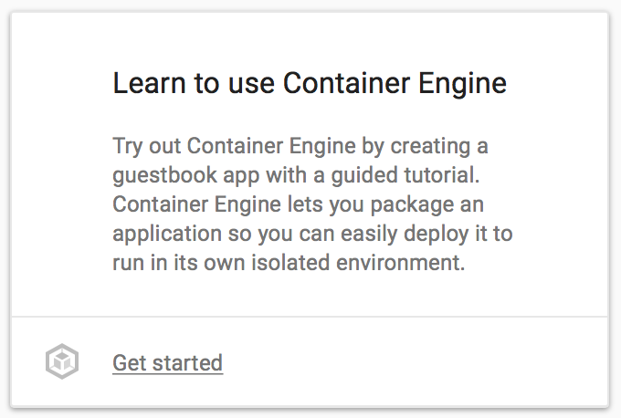
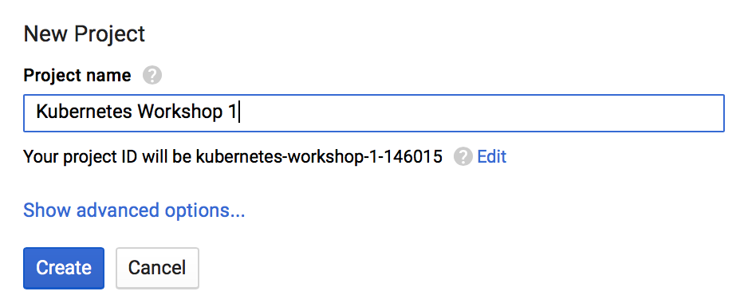
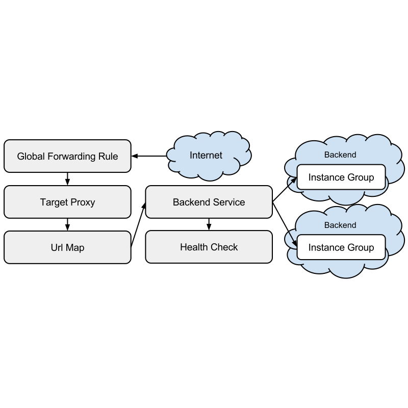

# Kubernetes Workshop - GCPUG

[](https://gitter.im/cloud-native-singapore/kubernetes-workshop?utm_source=badge&utm_medium=badge&utm_campaign=pr-badge&utm_content=badge)


This is the material for the "Kubernetes workshop" so far delivered at multiple conferences and events like:

* GCPUG Meetup @ NUS (2016, October)
* GCPUG Meetup @ Google Singapore (2016, December)

## Agenda

* Intro to Linux Containers, Pods & Container Orchestration
* Set Up for the Workshop
* GKE Workshop
  * Initializing gcloud tools
  * Creating a Container cluster
  * Getting Familiar with Creating, Exposing & Scaling Deployments
  * Working with a Sample NodeJS Hello World Application
  * Cleaning up

## Intro to Linux Containers, Pods & Container Orchestration

Technology giants such as Google have been running containers in production 
for years. Recent tooling introduced by Docker now made Linux containers easy 
to use for everyone. Due to their reduced footprint (compared to VMs) and 
layered filesystem approach, shipping and running containers provides
significant speed improvements. Allowing faster scaling, rolling updates and 
higher utilization of clustered resources.

As Engineering teams grow, collaboration on large monolithic frameworks 
becomes harder to coordinate. A popular solution is to break down complex
system into smaller components, allowing teams to be split and manage
these smaller component release cycles. This approach however adds the additional
complexity distributed systems carry.

Here as well, containers are a good fit and an ecosystem around container
orchestration grew to provide the crucial components to glue components
together.

One such orchestration framework came out of Google and was open sourced in
2014. Kubernetes is designed based on decades of experience running containers
in production at Google. Both Mesos and Kubernetes are based on the same 
research paper, with the latter taking a slightly different approach towards
resource management.

To date, Kubernetes has been adopted as one of the leading container orchestration
frameworks. As an open source solution - Kubernetes can be ran locally on bare metal
or using OpenStack as well as on existing Cloud Providers such as Digital Ocean and AWS.

Several managed commercial solutions exists such as CoreOS Tectonic and Google GKE,
fully abstracting the complexity of the Infrastructure away from the distributed
application running on top of them.

For this workshop we will use Google GKE to quickly get up and running with 
Kubernetes and get familiar with the Kubernetes way of managing deployments.

### Containers and Pods

Linux Containers are used to isolate the filesystem, memory resouces, cpu resources,
networking resources and many more on a process by process level. Although it is possible
to run multiple processes within a resource group, the linux kernel features providing
the isolation and accounting may cause behaviour unexpected for the Container 
constructed using those features.

As such, best practice generally recommends a single process per container. This however
does not provide the flexibility many existing utilities require (such as IPC or shared
filesystem resources).

Pods provide a pattern to manage multiple cooperating processes which form a cohesive unit of service.

In practice, Pods definitions may specify 1 or more containers which are required to run on the same cluster node 
and ensures these containers share the same network namespace (can communicate over localhost), as well as a set
of shared storage volumes.

A common example is:

* A multi-container pod with:
  * A file Puller process - synchronizing a remote resource to local disk
  * A Web service process - serving the synchronized resources from the same disk

[Official Kubernetes Pod Documentation](http://kubernetes.io/docs/user-guide/pods/)

## Set Up

### Part 1: Set up your local machine

1. Clone this repository
2. [Join the Chat](https://gitter.im/cloud-native-singapore/kubernetes-workshop)
3. Get Docker For [Mac](https://docs.docker.com/docker-for-mac/) / [Windows](https://docs.docker.com/docker-for-windows/)
4. Get [Jq](https://stedolan.github.io/jq)
5. Get [Google Cloud SDK](https://cloud.google.com/sdk/downloads)

### Part 2: Create GCP Account

[Sign up here](https://cloud.google.com/free-trial/?utm_source=google&utm_medium=cpc&utm_campaign=2016-q3-cloud-japac-sg-gcp-bkws-freetrial&utm_content=en&gclid=CjwKEAjw97K_BRCwmNTK26iM-hMSJABrkNtbhQzsSBu8KNVGXKs-ZzuZOntLgsvB2elLa4XJWqb24RoCdcrw_wcB)

Note: Quick side note, a GKE Tutorial is also available.

After clicking "More..." a Container Engine step through Tutorial is available:



### Alternative to GCP:

Follow these separate instructions to set up a single node k8s cluster locally:

[Get minikube](MINIKUBE.md)

## Workshop Start

### Initialize gcloud tools

Follow workflow in browser:
```
gcloud init
```

Optional: Learn more about [gcloud query and filtering features](https://cloudplatform.googleblog.com/2016/06/filtering-and-formatting-fun-with.html)

### Set GCP Project

If you haven't created during init, create a new project via google console in [the browser](https://console.cloud.google.com) ([Not possible to do via CLI yet](http://stackoverflow.com/questions/29212326/create-a-new-google-cloud-project-using-gcloud)):



Get list of projects
```
gcloud projects list
```

Assuming you created the project starting with kubernetes, get the project id:
```
export project_id=`gcloud projects list --format="value(projectId)" --filter "name:kubernetes*" --limit=1`
```

Set the workshop project to the active configuration
```
gcloud config set project $project_id
```

### Enable Billing

* Option 1: [Via the browser](https://console.cloud.google.com/billing)

* Option 2: Via the terminal ( still in alpha at the time of writing - this will prompt you to install Alpha SDK components)

```
gcloud alpha billing accounts list
export account_id=`gcloud alpha billing accounts list --format="value(name.basename())" --limit=1`
gcloud alpha billing accounts projects link $project_id --account-id=$account_id
```

### Create a Container cluster

Note the [Available zones for GCP](https://cloud.google.com/compute/docs/regions-zones/regions-zones#available)

We'll use `asia-east1-a` for workshop

```
gcloud config set compute/zone asia-east1-a
```
Note: there is no validation on the correctness of the zone while setting it

Note: If you receive error "Project is not fully initialized with default service accounts" - it may take up to 
20 minutes. Follow process on [Google cloud Console](https://console.cloud.google.com) - Container Engine. 
During previous workshops attendees mentioned opening the shell in the cloud seemed to kick start the process.

Review information for clusters in `asia-east1-a`
```
gcloud container get-server-config
```

Create Cluster with defaults for all parameters:

```
gcloud container clusters create workshop --no-async
```
Highlight of parameter defaults:

* `--machine-type`: `n1-standard-1` (1 vCPU & 3.75GB memory)
* `--num-nodes`:  3 
* `--enable-autoscaling`: off, when enabled - specify `--min-nodes` and `--max-nodes`
* `--image-type`:

  * `CONTAINER_VM`: Deprecated, debian 7 based images - Sysvinit resource manager
  * `GCI`: Google Container Image, chromium based - Systemd resource manager (Similar to CoreOS)
  
  Note: Oct 2016 - [Issues related to GCI](https://github.com/kubernetes/kubernetes/issues/34127) - if Glusterfs is required, use `--image-type container_vm`

See also [Full reference for `container clusters create` command](https://cloud.google.com/sdk/gcloud/reference/container/clusters/create)

Once the cluster command completed (takes about 5 minutes), verify all cluster listing:
```
gcloud container clusters list

# assuming you will use first cluster listed for remaining of workshop:
export cluster_name=`gcloud container clusters list --format="value(name.basename())" --limit=1`
```

Set cluster as the default:

```
gcloud config set container/cluster $cluster_name
```

Note: [Other Cluster Operations](https://cloud.google.com/container-engine/docs/clusters/operations)

### Install Kubectl

Either via Brew or gcloud:
```
gcloud components install kubectl
```

Get `kubectl` config
```
gcloud container clusters get-credentials $cluster_name
```
This will generate or update `~/.kube/config` with cluster info of the specified cluster

If prompted, enable your identity as a proxy for `kubectl` to call Google APIs:
```
gcloud beta auth application-default login
```
Note: [More details about & alternatives to this command](https://developers.google.com/identity/protocols/application-default-credentials)

You'll use `gcloud` to manage resources in your Google Cloud project and you'll use `kubectl` to manage resources within your Container Engine cluster. A single project can have multiple clusters, which makes it easy to have clusters that are made up of different machine types to satisfy different needs. When you create a cluster with gcloud it will automatically set up authentication for `kubectl`.

Review kubectl configuration and cluster info
```
kubectl config view | grep current
kubectl get no
kubectl cluster-info
```

Open Dashboard, use basic Auth credentials, default username is "Admin" (Unless cluster was created different `--username` argument
```
gcloud container clusters describe $cluster_name --format="value(masterAuth.password)"
```

## Getting Familiar with creating & exposing Deployments

Deployments are a powerfull concept in Kubernetes. We will look at writing deployments manually later,
but to get familiar with the power of `kubectl`, lets do a few imperative operations without going too deep into the desired state definitions behind the scenes (Desired State is where the power for reproducability really lies).

A useful scenario for these commands would be troubleshooting: 

for example: quickly run a shell in a pod for some in-cluster testing, or taking a faulty pod out of rotation and using a shell to investigate the cause of the failure without having production trafic routed to the containers.

### Deploying nginx proxy

As our first deployment, let's use the [official nginx image](https://hub.docker.com/_/nginx/)

```
kubectl run nginx --image=nginx:1.10-alpine --port=80
```
Note: We'll do a rolling update to version 1.11 later, so please use 1.10 (also, `latest` is not a version!)

Monitor the status of the pods being created by the deployment:
```
kubectl get po -w
```

To allow ingress traffic, we need to expose the nginx deployment as a NodePort on the cluster nodes:
```
kubectl expose deploy nginx --target-port=80 --type=NodePort
```
Note: Ingress works only if a [L7 Load Balancer controller](https://github.com/kubernetes/contrib/tree/master/ingress/controllers/gce) exists, this is the case on GKE (`kubectl get -n kube-system rc -l k8s-app=glbc -o yaml`)

Get the nodePort assigned
```
kubectl get svc nginx -o=json | jq -r .spec.ports[].nodePort?
```

Expose nginx through a Basic Ingress
```
kubectl create -f part1/basic-ingress.yaml
```

[Reference](https://cloud.google.com/container-engine/docs/tutorials/http-balancer)
Note: This will take several minutes to provision following Gcloud resources:

[Global Forwarding Rule](https://cloud.google.com/compute/docs/load-balancing/http/global-forwarding-rules) -> [TargetHttpProxy](https://cloud.google.com/compute/docs/load-balancing/http/target-proxies) -> [Url Map](https://cloud.google.com/compute/docs/load-balancing/http/url-map) -> [Backend Service](https://cloud.google.com/compute/docs/load-balancing/http/backend-service) -> [Instance Group](https://cloud.google.com/compute/docs/instance-groups/) (our
cluster nodes)



First resources come up quickly, Bakend Service however can take up to 15 minutes before being healthy:
```
kubectl describe ing basic-ingress
gcloud compute forwarding-rules list
gcloud compute target-http-proxies list
gcloud compute url-maps list
gcloud compute backend-services list

 # wait for service to become Healthy

watch -n 1 gcloud compute backend-services get-health <k8s-be-...>
```

Note: [Link to Console](https://console.cloud.google.com/networking/loadbalancing/list)

Troubleshooting - Verify Resource Quotas:
```
gcloud compute project-info describe
```

Get IP to our webserver:
```
export basic_ingress_ip=`kubectl get ing basic-ingress -o json | jq -r .status.loadBalancer.ingress[].ip`
open  http://$basic_ingress_ip/
```

[Full overview of ingress](http://kubernetes.io/docs/user-guide/ingress)

### Scope App Configuration to environment

When developing applications, best practice is to have multiple enviroments (i.e. Staging, Production)

Kubernetes [ConfigMaps](http://kubernetes.io/docs/user-guide/configmap/) allow us to scope configuration 
of our application, to the deployment target Enviroment.

For demonstration purposes, let's put the index.html in the environment and mount it into the pods.

```
kubectl create configmap nginx-index --from-file part1/index.html
```

Mount index.html into running pods

Edit the deployment Manifest:
```diff
30a31,33
>         # to the ContainerSpec add VolumeMount
>         volumeMounts:
>          - name: nginx-index
>            mountPath: /usr/share/nginx/html/
36a40,46
>       # to the PodSpec add volume definition
>       volumes:
>        - name: nginx-index
>          configMap:
>            name: nginx-index
>            items:
>            - key: index.html
>              path: index.html
```

Use the provided example:
```
kubectl apply -f part1/nginx-index-mounted.yaml
```

```
while true; do curl -sL $basic_ingress_ip | grep -i title; sleep 1; done
```

### Scaling nginx

Watch the pod events:
```
kubectl get po -w
```

Scale the number of nginx instances
```
kubectl scale deploy nginx --replicas=3
```

### Propagate configuration changes

Edit the configmap:
```
kubectl edit configmap nginx-index
```

Takes about 40 seconds for the new configuration values to propagate to all the pods (probably there's some caching for the index.html as well..)

Note: You would not deploy new application versions this way, this just demonstrate configuration changes are propagated without restarting / recreating pods.

### Rolling Update

Monitor the version deployed:
```
while true; do curl -sI $basic_ingress_ip | grep -i server; sleep 1; done
```

Monitor the Pod events
```
kubectl get po -w
```

Set the new image to the deployment
```
kubectl set image deployment/nginx nginx=nginx:1.11-alpine
```

Note: Adding the volume mount for the ConfigMap earlier also resulted in a rolling update

## Sample NodeJS Hello World application

[Reference](http://kubernetes.io/docs/hellonode/)

As the 2nd part of the Workshop, we will dive deeper into the components created by 
Kubernetes behind the scenes.

We will use a very simple to understand NodeJS application to show how we can package
up the local source code, ship it, deploy it and scale it on our cluster.
### Starting from source code

To keep the focus on the Kubernetes components, the very basic application below is used:

[part2/server.js](part2/server.js)
```
var http = require('http');
var handleRequest = function(request, response) {
    console.log('Received request for URL: ' + request.url);
      response.writeHead(200);
        response.end('Hello World!');
};
var www = http.createServer(handleRequest);
www.listen(8080);
```

It is not required to have NodeJS installed locally as we may package and run 
the application locally using Docker.

### Building Images locally

The process of "Packaging an application" with Docker is achieved by "building an image".

This can be compared to burning a filesystem to an Read Only medium as well as 
metadata on how to run this image.

The Docker build engine uses a [Dockerfile](https://docs.docker.com/engine/reference/builder/)
to control this image building process. 

The Dockerfile for this sample application is similarly very straight forward:
```
FROM node:4.4
EXPOSE 8080
COPY server.js .
CMD node server.js
```

Additionally, every image built, is tagged to allow versioning of the application releases

Build the Docker image for this example application with the following command:
```
docker build -t hello-node:v1 -f part2/Dockerfile part2/
```

If these steps succeeded, we can now see our `hello-node` image:
```
docker images | grep node
```

Once images have been build, these can be considered as immutable artifacts which 
can be shipped and ran in each environment (locally, on staging clusters and on production clusters)
in exactly the same way.

To run this image locally use:

```
docker run -d -p 8080:8080 --name hello_tutorial hello-node:v1
```

Verify we get the expected response:
```
curl localhost:8080 && echo
```

To ship images between environments, a centralized Registry of repositories is used.
In the next step we will ship our images via the GCP provided Registry (GCR)

### Pushing Images to GCR

[Choose Registry based on region](https://cloud.google.com/container-registry/docs/pushing?hl=en_US)
```
export registry=asia.gcr.io
```

To push the images to our GCP project, we need to tag them as follows:
```
docker tag hello-node:v1 $registry/$project_id/hello-node:v1
```

As this Registry contains the applications we will run on our cluster, security of very important.
the Google Cloud SDK provides us with a wrapper which will provision temporary credentials, ensuring
only those authorized may push and pull images:
```
gcloud docker -- push $registry/$project_id/nginx:1.10-alpine
```
Note: The `gcloud` wrapper did not work with [OSX Keychain](https://github.com/docker/docker-credential-helpers) at the time of writing.

### Creating a Deployment

As our image is now available on the Registry, we will define the Kubernetes deployment manifest

```
kubectl run hello-node --image=$registry/$project_id/hello-node:v1 --port=8080
```

### Templating Deployment with Helm Charts

To centralize the management of the Kubernetes deployments, [Helm](https://github.com/kubernetes/helm) should be considered.

Due to time limits, this will not be covered in the current iteration of this Workshop.

## Cleaning Up

Delete container cluster
```
gcloud container clusters delete $cluster_name
```

## Other Sample applications

### Flask Bookshelf Application (GCP specific)

[GitHub Repo](https://github.com/GoogleCloudPlatform/getting-started-python/tree/master/optional-container-engine)
And [GKE Tutorial](https://cloud.google.com/python/tutorials/bookshelf-on-container-engine)

### PHP Guestbook Application with Redis

[GKE Tutorial](https://cloud.google.com/container-engine/docs/tutorials/guestbook)

### Microservices Demo Application

Real world demo application:
[Design](https://github.com/microservices-demo/microservices-demo/blob/master/docs/design.md)
And [Generic k8s Tutorial](https://github.com/microservices-demo/microservices-demo/tree/master/deploy/kubernetes)

## Additional Links

* [Running a Stateless Application](http://kubernetes.io/docs/tutorials/stateless-application/run-stateless-application-deployment/)
* [GKE Release Notes](https://cloud.google.com/container-engine/release-notes)
